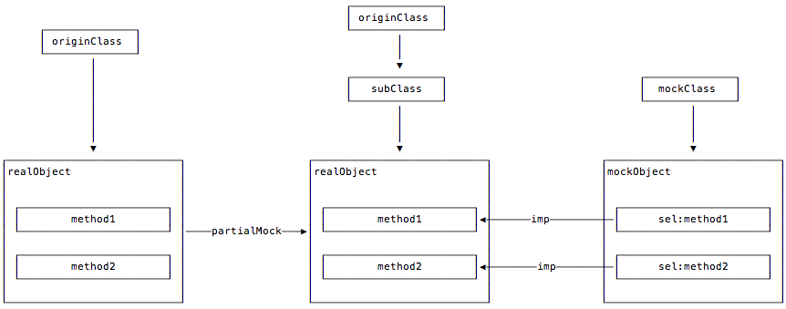
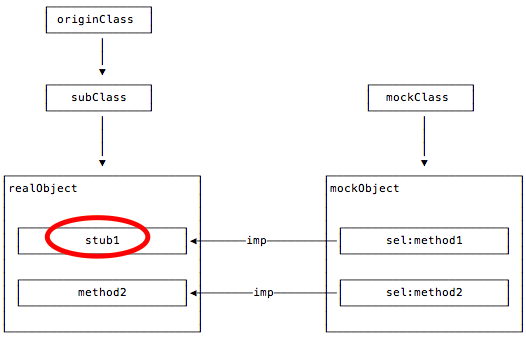

# OCMock

**Mock objects for Objective-C**

	Stubs – return values for specific method invocations
	Dynamic Mocks – verify interaction patterns
	Partial Mocks – overwrite methods of existing objects

## 1. 集成OCMock
#### cocoapods

	pod 'OCMock'
	#import <OCMock/OCMock.h>

##	2. 基本用法
我们把测试分为三个阶段`given`、`when`、`then`，那么一般都是在`given`阶段mock，虽然`OCMock`也提供了一些方法用于`then`阶段，如`OCMVerify()`，这个后面再讲。

	// given
	id mock = OCMClassMock([SomeClass class]);
	OCMStub([mock someMethod]).andReturn(someValue);
	// when
	do some test ...
	// then
	verify!

`OCMock`提供了丰富的`Mock`和`Stub`，官方文档很详细，可以查看官方文档，这里我主要通过一些例子来说明怎么使用。
[OCMock 3 reference](http://ocmock.org/reference/)
## 3. 举个栗子
#### Mock && Stub

	@interface Miku : NSObject

	@property (nonatomic, strong) MikuHelper *helper;
	@property (nonatomic, assign) BOOL singing;
	
	- (void)sing;
	
	@end
我们有个类叫`Miku`，她会唱歌，唱歌做什么呢，会把自己标记为正在唱歌

	- (void)sing {
	    NSString *songName = [[MikuHelper shareInstance] fetchSong];
	    if (songName) {
	        self.singing = YES;
	    }else {
	        self.singing = NO;
	    }
	}
她有个助理，叫`MikuHelper`，它负责给`Miku`提供歌曲。

	@interface MikuHelper : NSObject

	+ (instancetype)shareInstance;

	- (NSString *)fetchSong;

	@end
现在，我们来测`Miku`的`sing`行为，这里我们假定助手的功能一切正常啊，啊，它必须是正常的，所以，这里我们就要`Mock`这个助手。

	id mikuHelperMock = OCMClassMock([MikuHelper class]);
`shareInstance`是个`class method`，它会返回一个单例，mock it！

    OCMStub([mikuHelperMock shareInstance]).andReturn(mikuHelperMock);
`fetchSong`是个`instance method`，它返回歌曲名字，mock it！

    OCMStub([mikuHelperMock fetchSong]).andReturn(@"Tell Your World");
**Tips**：这里可能会出现`class method`和`instance method`重名的情况，可以用`ClassMethod()`标记以区分 

	OCMStub(ClassMethod([classMock ambiguousMethod])).andReturn(@"Test string");
那么，完整的测试例子会是这样的

    // given
    id mikuHelperMock = OCMClassMock([MikuHelper class]);
    OCMStub([mikuHelperMock shareInstance]).andReturn(mikuHelperMock);
    OCMStub([mikuHelperMock fetchSong]).andReturn(@"Tell Your World");
    Miku *miku = [Miku new];
    miku.helper = mikuHelperMock   
    // when
    [miku sing];
    // then
    XCTAssertTrue(miku.singing);
#### block参数
接下来出现这种情况，助手需要联网获取歌曲，然后通过`block`返回歌曲，而不是通过返回值返回

	- (void)fetchSongByInternet:(void (^)(NSString *song))callback;
`OCMock`提供了一个一个类`OCMArg`，它包含了一套对参数的操作([详见官方文档](http://ocmock.org/reference/#argument-rconstraints))，包括

	// 对参数的限制
	OCMStub([mock someMethod:aValue)
	OCMStub([mock someMethod:[OCMArg isNil]])
	OCMStub([mock someMethod:[OCMArg isNotNil]])
	.
	.
	// 对参数的修改
	OCMStub([mock someMethodWithReferenceArgument:[OCMArg setTo:anObject]]);
	.
	.
	// 对blcok参数的设置
	OCMStub([mock someMethodWithBlock:([OCMArg invokeBlockWithArgs:@"First arg", nil])]);
这里，就需要用到最后这一个，mock it！

    OCMStub([mikuHelperMock fetchSongByInternet:([OCMArg invokeBlockWithArgs:@"Tell Your World", nil])]);
**Tips**：记得`block`参数需要用`()`包起来！

#### Verify
接下来，设定`Miku`一旦开始唱歌，她便要求助手开始跳舞，哈哈，不要问为什么是助手跳舞，因为`OCMVerify`只能验证`Mock`对象的行为

	- (void)sing {
	    [[MikuHelper shareInstance] fetchSongByInternet:^(NSString *song) {
	        if (song) {
	            self.singing = YES;
	            [self.helper dance];
	        }else {
	            self.singing = NO;
	        }
	    }];
	}
然后，我们在测试的`then`阶段加入，便能验证助手到底跳舞了没- -。

	// then
	OCMVerify([mikuHelperMock dance]);
#### PartialMock
这时候，有同学就要说了，我们不想看助手跳舞啊，要看`Miku`跳舞！好那就让`Miku`跳，这里就要用到`OCMock`的`PartialMock`。

	id partialMock = OCMPartialMock(anObject);
	/* run code under test */
	OCMVerify([partialMock someMethod]);
于是乎，测试的完整代码会像下面这样

    // given
    id mikuHelperMock = OCMClassMock([MikuHelper class]);
    OCMStub([mikuHelperMock shareInstance]).andReturn(mikuHelperMock);
    OCMStub([mikuHelperMock fetchSongByInternet:([OCMArg invokeBlockWithArgs:@"Tell Your World", nil])]);
    Miku *miku = [Miku new];
    miku.helper = mikuHelperMock
    id mikuMock = OCMPartialMock(miku);
    // when
    [miku sing];
    // then
    XCTAssertTrue(miku.singing);
    OCMVerify([mikuMock dance]);
这里可能会有点疑惑，这里是`Miku`在跳舞，但是却去验证`mikuMock`，这样准确吗？
#### Mock VS ParitialMock
以下是根据官方文档和源码做的一些理解，如有不对，看看就好，欢迎指正。

普通的`Mock`是根据一个类去创建对应的`mock`对象，是一个纯粹的`mock`对象，也就是说，如果某个方法没有对应的`stub`，那么它将不具备任何意义。

`PartialMock`则是根据一个现有对象去创建`mock`对象，这个`mock`对象会去`hook`原对象的大部分方法（不包括一些消息转发相关方法、以及一些内存管理相关方法等），也就是说，如果某个方法没有`stub`，那么它将会去调用原对象的对应方法，如果有`stub`，那么原对象的对应方法也会被`stub`覆盖。

其实现原理是：`ParitialMock`的时候，不仅会创建一个`mock`对象，同时还会创建一个原对象所属类的子类，并改变原对象的类为这个子类，然后通过`runtime`，对这个子类的方法进行拦截，并做了一系列处理，比如添加验证信息，为`mock`对象添加`hook`这些方法，若有`stub`的话，覆盖对应方法，下面图示可以作为一个参考。

**partialMock**

**stub**

所以，验证`mikuMock`有没有跳舞也就是验证`miku`有没有跳舞
**结论**：利用`PartialMock`可以做到`verify`非`mock`对象的行为。

